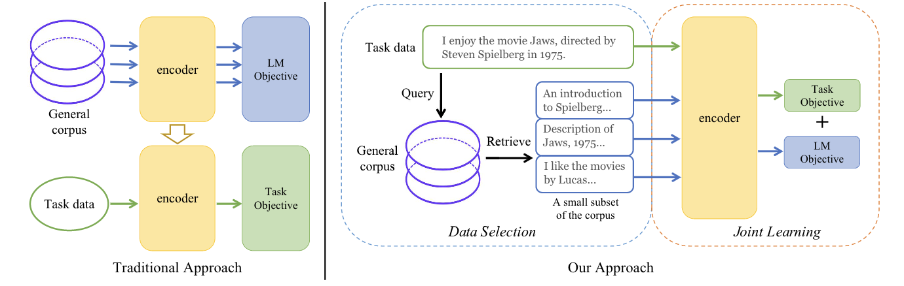

## NLP From Scratch Without Large-Scale Pretraining
This repository contains the code, pre-trained model checkpoints and collected datasets for our paper: [NLP From Scratch Without Large-Scale Pretraining: A Simple and Efficient Framework](https://arxiv.org/abs/2111.04130). 

In our proposed framework, named ***TLM*** (task-driven language modeling), instead of training a language model over the entire general corpus and then finetuning it on task data, we first use task data as queries to retrieve a tiny subset of the general corpus, and then perform joint learning on both the task objective and self-supervised language modeling objective. 


### Requirements
We implement our models and training loops based on the opensource products from [HuggingFace](https://huggingface.co/). The core denpencies of this repository are listed in `requirements.txt`, which can be installed through:
```
pip install -r requirements.txt
```
All our experiments are conducted on a node with 8 [A100 40GB SXM](https://www.nvidia.cn/data-center/a100/) gpus. Different computational devices may result in slightly different results from the reported ones.

### Models and Datasets

We release the trained models on 8 tasks with 3 different scales, together with the task datasets and selected external data. Our released model checkpoints, datasets and the performance of each model for each task are listed in the following table.
| | [AGNews](https://huggingface.co/datasets/yxchar/ag-tlm) | [Hyp.](https://huggingface.co/datasets/yxchar/hyp-tlm)| [Help.](https://huggingface.co/datasets/yxchar/amazon-tlm)| [IMDB](https://huggingface.co/datasets/yxchar/imdb-tlm)| [ACL.](https://huggingface.co/datasets/yxchar/citation_intent-tlm)| [SciERC](https://huggingface.co/datasets/yxchar/sciie-tlm)| [Chem.](https://huggingface.co/datasets/yxchar/chemprot-tlm)|[RCT](https://huggingface.co/datasets/yxchar/rct-20k-tlm) |
|-------------|:-:|:-:|:-:|:-:|:-:|:-:|:-:|:-:|
|*Small*| [93.74](https://huggingface.co/yxchar/tlm-ag-small-scale)| [93.53](https://huggingface.co/yxchar/tlm-hyp-small-scale)| [70.54](https://huggingface.co/yxchar/tlm-amazon-small-scale)| [93.08](https://huggingface.co/yxchar/tlm-imdb-small-scale)|[69.84](https://huggingface.co/yxchar/tlm-citation_intent-small-scale) |[80.51](https://huggingface.co/yxchar/tlm-sciie-small-scale) | [81.99](https://huggingface.co/yxchar/tlm-chemprot-small-scale)|[86.99](https://huggingface.co/yxchar/tlm-rct-20k-small-scale)|
|*Medium*|[93.96](https://huggingface.co/yxchar/tlm-ag-medium-scale)|[94.05](https://huggingface.co/yxchar/tlm-hyp-medium-scale)|[70.90](https://huggingface.co/yxchar/tlm-amazon-medium-scale)|[93.97](https://huggingface.co/yxchar/tlm-imdb-medium-scale)|[72.37](https://huggingface.co/yxchar/tlm-citation_intent-medium-scale)|[81.88](https://huggingface.co/yxchar/tlm-sciie-medium-scale)|[83.24](https://huggingface.co/yxchar/tlm-chemprot-medium-scale)|[87.28](https://huggingface.co/yxchar/tlm-rct-20k-medium-scale)|
|*Large*|[94.36](https://huggingface.co/yxchar/tlm-ag-large-scale)|[95.16](https://huggingface.co/yxchar/tlm-hyp-large-scale)|[72.49](https://huggingface.co/yxchar/tlm-amazon-large-scale)|[95.77](https://huggingface.co/yxchar/tlm-imdb-medium-scale)|[72.19](https://huggingface.co/yxchar/tlm-citation_intent-large-scale)|[83.29](https://huggingface.co/yxchar/tlm-sciie-large-scale)|[85.12](https://huggingface.co/yxchar/tlm-chemprot-large-scale)|[87.50](https://huggingface.co/yxchar/tlm-rct-20k-large-scale)|

The released models and datasets are compatible with [HuggingFace's Transformers](https://huggingface.co/transformers/) and [Datasets](https://huggingface.co/docs/datasets/index.html). We provide an example script to evaluate a model checkpoints on a certain task, run 
```
bash example_scripts/evaluate.sh
```
To get the evaluation results for SciERC with a small-scale model.

### Training

We provide two example scripts to train a model from scratch. To train a small-scale model for SciERC, run
```
bash example_scripts/train.sh && bash example_scripts/finetune.sh
```
Here `example_scripts/train.sh` corresponds to the first stage training where the external data ratio and MLM weight are non-zero, and `example_scripts/finetune.sh` corresponds to the second training stage where no external data or self-supervised loss can be perceived by the model. 

### Data Selection

We provide a python script in `src/data_selection.py` to perform data selection from a customized source dataset with queries from a customized target dataset. 

To select data with the provided scripts, first download, install and start [ElasticSearch](https://www.elastic.co/cn/elasticsearch/) by the default settings, then you can run
```
bash example_scripts/data_selection.sh
```
The above script retrieves sequences from an example source corpus which are similar to an example task dataset. Feel free to build inverted indices for your own corpus and select data for your own tasks.

### Citation
Please cite our paper if you use TLM in your work:
```bibtex
@misc{yao2021tlm,
title={NLP From Scratch Without Large-Scale Pretraining: A Simple and Efficient Framework},
author={Yao, Xingcheng and Zheng, Yanan and Yang, Xiaocong and Yang, Zhilin},
year={2021}
}
```
